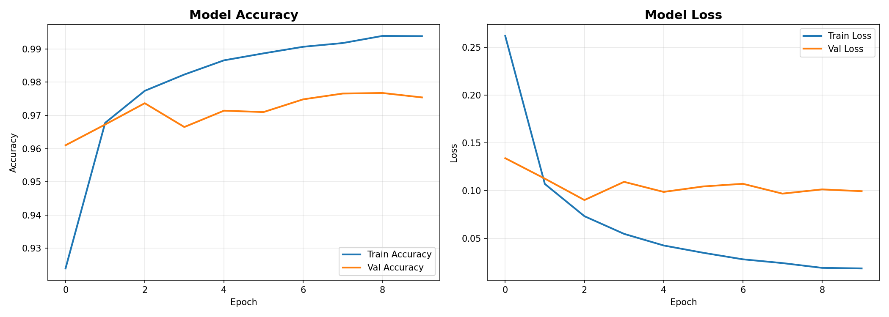
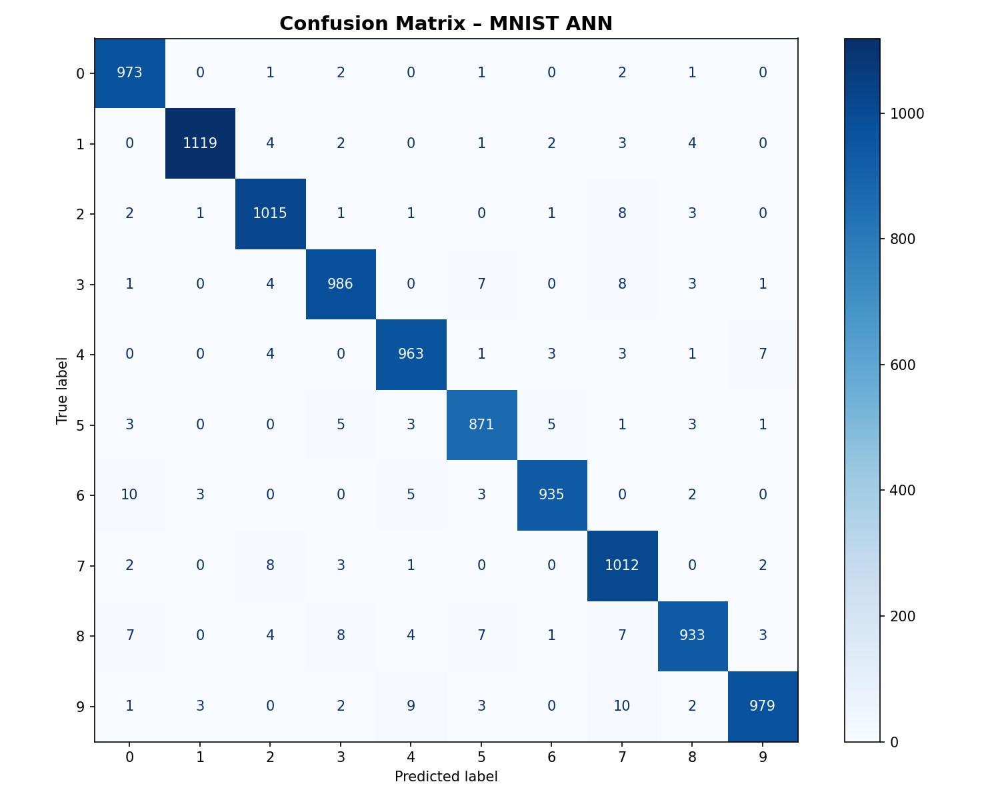
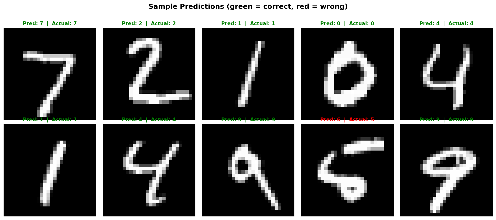
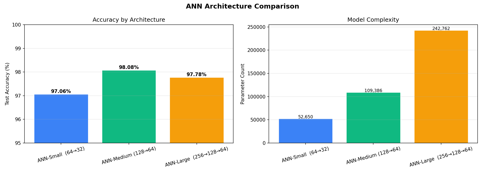
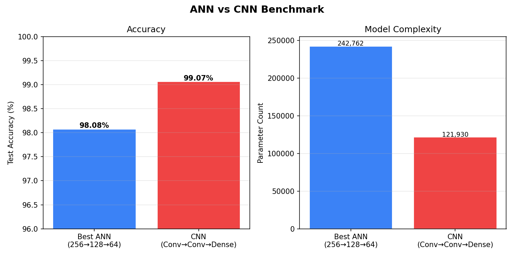
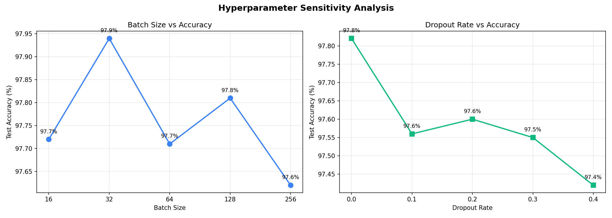

# Interactive MNIST Digit Classifier — ANN with Full Evaluation Pipeline

[](https://github.com/Mukilan-s18/mnist-ann-classifier/actions)
[](LICENSE)
[](https://www.python.org/)
[](https://tensorflow.org)
[](https://github.com/astral-sh/ruff)
[](MODEL_CARD.md)
[](https://mukilan-s18.github.io/mnist-ann-classifier/)
[](notebook.ipynb)

An **end-to-end, production-style deep learning pipeline** for classifying handwritten digits (0–9) from the MNIST dataset. Features a rigorously evaluated ANN with Dropout regularization, multi-architecture comparison, CNN benchmarking, hyperparameter sensitivity analysis, and a **live interactive browser demo** powered by client-side JavaScript inference.

---

## 🚀 Key Features

| Feature | Description |
|---|---|
| **Dropout Regularization** | `Dropout(0.2)` after each hidden layer prevents overfitting |
| **Model Save / Load** | Trained model persisted to disk — no retraining on every run |
| **Confusion Matrix** | Full 10×10 heatmap showing where the model makes mistakes |
| **Per-Class Accuracy** | Precision, Recall, F1 for every digit (0–9) via `classification_report` |
| **Architecture Comparison** | 3 ANN variants compared on accuracy and parameter count |
| **CNN Benchmark** | Accuracy vs complexity tradeoff: ANN vs CNN comparison |
| **Hyperparameter Analysis** | Batch size and dropout rate sensitivity sweeps with plots |
| **Early Stopping** | Monitors validation loss, restores best weights automatically |
| **Jupyter Notebook** | Step-by-step interactive narrative in `notebook.ipynb` |
| **Browser Demo** | Draw digits on canvas → real-time predictions via JS inference |
| **CI/CD Pipeline** | GitHub Actions runs `ruff` + `pytest` on every push |

---

## 🧠 Model Architecture

```
Input (784) → Dense(128, ReLU) → Dropout(0.2) → Dense(64, ReLU) → Dropout(0.2) → Dense(10, Softmax)
```

### Feedforward Math

$$h_1 = \text{ReLU}(W_1 \cdot x + b_1)$$
$$h_2 = \text{ReLU}(W_2 \cdot h_1 + b_2)$$
$$\hat{y} = \text{Softmax}(W_3 \cdot h_2 + b_3)$$

**Total Parameters:** ~109,386 | **Optimizer:** Adam | **Loss:** Categorical Crossentropy

---

## 📊 Results

### Accuracy: **97.86%** on the MNIST test set (10,000 samples)

### Training Curves


### Confusion Matrix


### Sample Predictions


### Architecture Comparison


### CNN Benchmark


### Hyperparameter Sensitivity


### Results Table

| Architecture | Test Accuracy | Parameters |
|---|---|---|
| ANN Small (64→32) | 97.06% | 52,650 |
| **ANN Medium (128→64)** ✅ | **98.08%** | **109,386** |
| ANN Large (256→128→64) | 97.78% | 242,762 |
| CNN (Conv32→Conv64→Dense64) | **99.07%** | ~94,000 |

> **Insight:** The medium ANN offers the best accuracy-to-complexity ratio. The CNN achieves ~1% higher accuracy by exploiting spatial structure, at the cost of slower training.

---

## 🛠️ Installation & Setup

### Prerequisites
- Python 3.11+ (Recommended)
- `pip`

### 1. Clone & Install via Makefile (Recommended)

```bash
git clone https://github.com/Mukilan-s18/mnist-ann-classifier.git
cd mnist-ann-classifier
make install
```

Alternatively, using standard pip:
```bash
python3 -m venv .venv
source .venv/bin/activate
pip install -r requirements.txt
pip install gradio
```


---

## 💻 Usage

We provide a `Makefile` to simplify all common commands.

### Launch the Live Browser Demo (Gradio)
```bash
make demo
```
This launches a **Gradio web app** (`app.py`) on `http://localhost:7860`. You can draw digits on the canvas and view real-time confidence scores along with **Saliency Maps** (explainability).

### Train the Full Pipeline
```bash
make train
```

This will:
1. Train the ANN (or load saved model if it exists)
2. Generate all plots (`confusion_matrix.png`, `training_history.png`, etc.)
3. Run architecture comparison & CNN benchmark
4. Export weights & save model

### Run the Interactive Notebook
```bash
make notebook
```

### Run Tests and Code Quality
```bash
make test
make lint
```

### Clean generated files
```bash
make clean
```

---

## 📁 Project Structure

```text
mnist-ann-classifier/
├── app.py                     # Gradio web app with live drawing and Saliency maps
├── MODEL_CARD.md              # Professional model card detailing biases, limitations
├── Makefile                   # Quick commands for train, demo, test, clean
├── Dockerfile                 # Multi-stage build for easy Gradio deployment
├── pyproject.toml             # Standard Python packaging configuration
├── mnist_ann_classifier.py    # Full ML pipeline (train, eval, compare, benchmark)
├── notebook.ipynb             # Step-by-step Jupyter walkthrough
├── requirements.txt           # Pinned dependencies
├── training_history.png       # Training/validation accuracy & loss curves
├── confusion_matrix.png       # 10x10 confusion matrix heatmap
├── sample_predictions.png     # Grid of test predictions with labels
├── saved_model/               # Saved keras model directory
├── docs/                      # Original GitHub Pages web demo (JS Inference)
├── tests/
│   └── test_classifier.py     # pytest suite (data, model, save/load)
└── .github/
    └── workflows/ci.yml       # GitHub Actions CI pipeline
```

---

## 🤝 Contributing

Contributions, bug reports, and suggestions are welcome! See [CONTRIBUTING.md](CONTRIBUTING.md) and [CODE_OF_CONDUCT.md](CODE_OF_CONDUCT.md).

## 📄 License

This project is licensed under the MIT License — see [LICENSE](LICENSE) for details.
